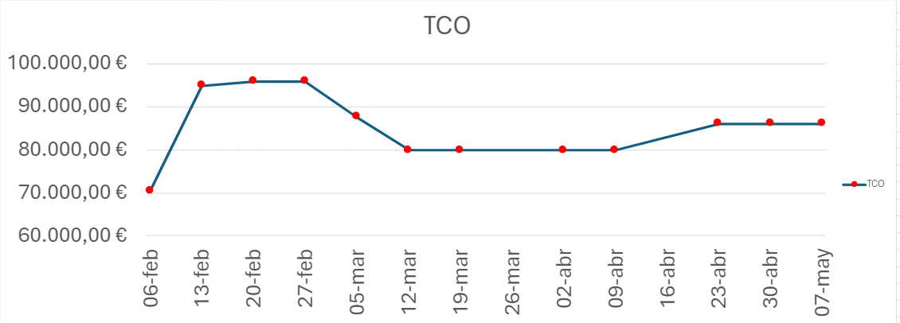
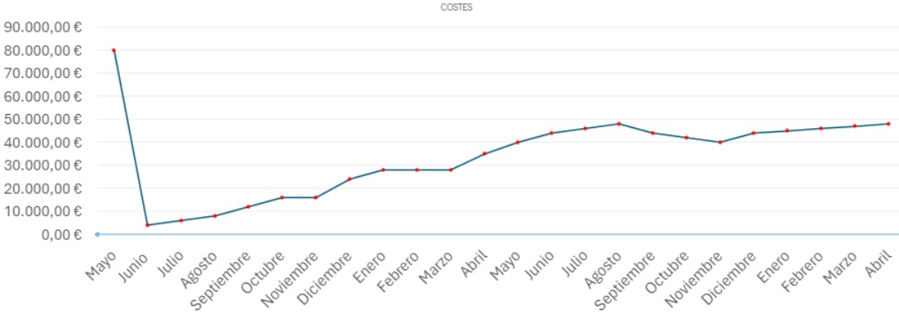
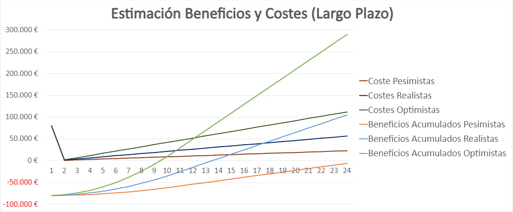

# TCO
---

<MDXLayout>
  
</MDXLayout>

---

# GRUPO 2

### PPL

| Fecha     | Versión | Autores                                                | Descripción                           | Entrega |
|-----------|---------|--------------------------------------------------------|---------------------------------------|---------|
| 20/02/2024| V1.0    | Carlos Varela Soult, Raúl Montalbán Martín | Versión inicial de análisis de costes | DP      |
| 04/03/2024| V2.0    | José Carlos Ortiz Gutiérrez, Iñigo Ruiz Marchueta, Paula Peña Fernández, Juan José Gómez Borrallo| Actualización Sprint 1 y review       | S1      |
| 01/04/2024| V3.0    | Iñigo Ruiz Marchueta, Paula Peña Fernández, Adrián Romero Flores                                 | Actualización Sprint 2 y review       | S2      |
| 21/04/2024| V4.0    | Paula Peña Fernández, Iñigo Ruiz Marchueta, Adrián Romero Flores             | Actualización Sprint 3 y review       | S3      |
| 05/05/2024| V5.0    | Paula Peña Fernández            | Actualización PPL      |PPL      |

### Índice

- [Hora de servicio mínima](#hora-de-servicio-mínima)
- [CAPEX](#capex)
  - [Desarrollo](#desarrollo)
  - [Infraestructuras y licencias](#infraestructuras-y-licencias)
- [OPEX](#opex)
  - [Costes de Infraestructuras y Licencias](#costes-de-infraestructuras-y-licencias)
  - [Costes de operación mensual](#costes-de-operación-mensual)
  - [Costes de Recompensa Usuarios Pilotos](#costes-de-recompensa-usuarios-pilotos)
  - [Costes de Marketing](#costes-de-marketing)
- [Evolución del TCO](#evolución-del-tco)
- [Estimación del TCO](#estimación-del-tco)
- [Desarrollo TCO en 24 meses](#desarrollo-tco-en-24-meses)
- [Análisis de Escenarios](#análisis-de-escenarios)
  - [ESTIMACIÓN PESIMISTA 2%](#estimación-pesimista-2)
    - [Bares](#bares)
    - [Ocio Nocturno](#ocio-nocturno)
    - [Autónomo](#autónomo)
  - [ESTIMACIÓN OPTIMISTA 10%](#estimación-optimista-10)
    - [Bares](#bares-1)
    - [Ocio Nocturno](#ocio-nocturno-1)
    - [Autónomo](#autónomo-1)
  - [ESTIMACIÓN REALISTA 5%](#estimación-realista-5)
    - [Bares](#bares-2)
    - [Ocio Nocturno](#ocio-nocturno-2)
    - [Autónomo](#autónomo-2)
    - [Estimación a Corto Plazo](#estimación-a-corto-plazo)
    - [Estimación a Largo Plazo](#estimación-a-largo-plazo)
- [Bibliografía](#bibliografía)

### Hora de servicio mínima 
|HSM | 20 € |
|--|-----|

### CAPEX

#### Desarrollo
| Coste | 56.200,00 € |
|--|-----|

| Rol | HSM | Cantidad |Meses| Sueldo mensual |
|---|---|---|---|---|
| Programador web | x1 | 10 | 4| 800€ |
| Analista programador web | x1.5 | 2 |4| 1.200 € |
| Jefe de proyecto | x2 | 1 |4| 1.600 € |
| Diseñador gráfico | x1.5 | 1 | 4| 1.200 € |
| CM | x1.5 | 2 |1| 2.400 € |
| Encargado GPDR | x1 | 1 | 1.25| 1.000 € |

#### Infraestructuras y licencias
| Coste | 2.442,00 € |
|--|-----|

|Paquete|Meses|Precio|Cantidad|
|---|---|---|---|
|Oficina |4|360 €/mes|1|
|Portatiles|---|1.000 €|14|
|Dominio|---|2 €|1|

### OPEX

#### Costes de Infraestructuras y Licencias
| Coste | 2.877,28 € |
|--|-----|

| Paquete | Precio/mes | Cantidad | Meses | Total |
|---|---|---|---|---|
| Google Cloud | 302,92 € | 1 | 4 | 1.211,68 € |
| GitHub Enterprise | 19,51 € | 14 | 4 | 1.092,56 € |
| GitHub Copilot | 9,28 € | 14 | 4 | 519,68 € |
| SonarCloud | 11,00 € | 1 | 4 | 44,00 € |
| Github Actions | 2,34 € | 1 | 4 | 9,36 € |
| Email Check | 0,00 € | 1 | 2 | 0 € |

#### Costes de operación mensual 
| Coste | 2.128,3 € |
|--|-----|

| Paquete | Precio/mes | Cantidad | Meses | Total |
|---|---|---|---|---|
| Técnico de soporte nivel 1 | 800,00 € | 2 | 1 | 1.600,00 € |
| Google Cloud | 302,92 € | 1 | 1 | 302,92 € |
| GitHub Enterprise | 19,51 € | 2 | 1 | 39,02 € |
| SonarCloud | 11,00 € | 1 | 1 | 11,00 € |
| GitHub Actions | 2,30 € | 1 | 1 | 2,30 € |
| Email Check | 50,00 € | 1 | 1 | 50,00 € |
| PUblicación PlayStore| 25,00 € | 1 | 1 | 25,00 € |
| Publicación AppStore | 99,00 € | 1 | 1 | 99,00 € |

#### Costes de Recompensa Usuarios Pilotos
| Coste |  1.402,92 € |
|--|-----|

| Rol | Precio/mes | Cantidad | Meses | Total |
|---|---|---|---|---|
| Usuarios Pilotos Cliente | 12,99 € | 9 | 12 | 1.402,92 € |

#### Costes de Marketing
| Coste |  3.748,00 € |
|--|-----|

| Paquete | Precio/un | Cantidad | Días | Extra | Total |
|---|---|---|---|---|
| Maqueta de ocial | 130,00 € | 20 |  |  | 2.600,00 € |
| Permisos de publicidad | 150,00 € | 20 | 30 | 1,33 | 948,00 € |
| Merchandising | 1,00 € | 200 | 1 |  | 200,00 € |

### Evolución del TCO 

### Estimación del TCO
Contingencia del 10% 
__TCO Mensual = 7.400 €__ 
Estimación con 1000 usuarios concurrentes

### Desarrollo TCO en 24 meses

# Análisis de Escenarios

## ESTIMACIÓN PESIMISTA 2%

### Bares

|  SUSCRIPCIÓN | PRECIO/MES | CANTIDAD | MESES | TOTAL |
|---|---|---|---|---|
| BÁSICO | 6,99 | 1100 | 10 | 76.890,00 € |
| PRO | 12,99 | 100 | 10 | 12.990,00 € |

### Ocio Nocturno

| SUSCRIPCIÓN | PRECIO/MES | CANTIDAD | MESES | TOTAL |
|---|---|---|---|---|
| BÁSICO | 6,99 | 135 | 12 | 11.323,80 € |
| PRO | 12,99 | 15 | 12 | 2.338,20 € |

### Autónomo 

| SUSCRIPCIÓN | PRECIO/MES | CANTIDAD | MESES | TOTAL |
|---|---|---|---|---|
| BÁSICO | 6,99 | 450 | 12 | 37.746,00 € |
| PRO | 12,99 | 50 | 12 | 7.794,00 € |

|**Total** | **149.082,00 €** |
|---|---|

## ESTIMACIÓN OPTIMISTA 10%

### Bares

|  SUSCRIPCIÓN | PRECIO/MES | CANTIDAD | MESES | TOTAL |
|---|---|---|---|---|
| BÁSICO | 6,99 | 5750 | 12 | 482.310,00 € |
| PRO | 12,99 | 250 | 12 | 38.970,00 € |

### Ocio Nocturno

| SUSCRIPCIÓN | PRECIO/MES | CANTIDAD | MESES | TOTAL |
|---|---|---|---|---|
| BÁSICO | 6,99 | 700 | 12 | 58.716,00 € |
| PRO | 12,99 | 50 | 12 | 7.794,00 € |

### Autónomo 

| SUSCRIPCIÓN | PRECIO/MES | CANTIDAD | MESES | TOTAL |
|---|---|---|---|---|
| BÁSICO | 6,99 | 2350 | 12 | 197.118,00 € |
| PRO | 12,99 | 150 | 12 | 23.382,00 € |

|**Total** | **808.290,00 €** |
|---|---|

## ESTIMACIÓN REALISTA 5%

### Bares

|  SUSCRIPCIÓN | PRECIO/MES | CANTIDAD | MESES | TOTAL |
|---|---|---|---|---|
| BÁSICO | 6,99 | 3800 | 10 | 265.620,00 € |
| PRO | 12,99 | 200 | 10 | 25.980,00 € |

### Ocio Nocturno

| SUSCRIPCIÓN | PRECIO/MES | CANTIDAD | MESES | TOTAL |
|---|---|---|---|---|
| BÁSICO | 6,99 | 325 | 12 | 27.261,00 € |
| PRO | 12,99 | 50 | 12 | 7.794,00 € |

### Autónomo 

| SUSCRIPCIÓN | PRECIO/MES | CANTIDAD | MESES | TOTAL |
|---|---|---|---|---|
| BÁSICO | 6,99 | 1150 | 12 | 96.462,00 € |
| PRO | 12,99 | 100 | 12 | 15.588,00 € |

|**Total** | **438.705,00 €** |
|---|---|

### Estimación a Largo Plazo

### Bibliografía
[Enlace](https://cloud.google.com/products/calculator-legacy/#id=c76cf4c4-88ed-4a0b-bcf1-b8fd71e6c4c3)
[Enlace](https://github.com/pricing)
[Enlace](https://www.sonarsource.com/plans-and-pricing/#sonarcloud)
[Enlace](https://www.idealista.com/inmueble/104022694/)
[Enlace](https://rapidapi.com/Top-Rated/api/e-mail-check-invalid-or-disposable-domain/pricing)
[Enlace](https://elpais.com/especiales-branded/es-laliga/2018/sabes-si-tu-bar-piratea-el-futbol-mas-de-60000-locales-lo-hacen/#:~:text=Alrededor%20de%20120.000%20bares%20apuestan,de%20acuerdo%20con%20sus%20datos)
[Enlace](https://euroefe.euractiv.es/section/creacion-y-propiedad-intelectual/news/fuerte-caida-de-los-usuarios-de-futbol-pirata-en-espana-desde-2015/)
[Enlace](https://www.cope.es/programas/tiempo-de-juego/noticias/sube-pirateria-futbol-millones-descargas-apps-menos-abonados-20231019_2956954)
[Enlace](https://www.csd.gob.es/sites/default/files/media/files/2022-12/Encuesta%20de%20H%C3%A1bitos%20Deportivos%20en%20Espa%C3%B1a%202022.%20S%C3%ADntesis%20de%20resultados.pdf)
[Enlace](https://www.rtve.es/playz/20230411/ocio-nocturno-soberania-dj/2438091.shtml)
[Enlace](https://www.lavanguardia.com/local/madrid/20210826/7682180/ocio-nocturno-madrid-triplica-facturacion-nacional.html)
[Enlace](https://infoautonomos.com/autonomos-espana-ley/cuantos-autonomos-espana-como-son/)
[Enlace](https://www.mites.gob.es/ficheros/ministerio/sec_trabajo/autonomos/economia-soc/autonomos/estadistica/2023/1TRIMESTRE/PUBLICACION_PRINCIPAL_1_TRIM_2023.pdf)
[Enlace](https://blog.xolo.io/es/estad%C3%ADsticas-de-aut%C3%B3nomos-en-espa%C3%B1a-verdades-y-sorpresas)

