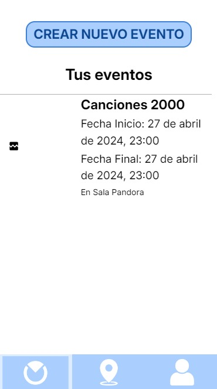

# Revision
---

<MDXLayout>
  
</MDXLayout>

---

# GRUPO 2

### WPL

|Fecha|Versión|Autores|Descripción |Entrega|
| :- | :- |:-| :- | :- |
|04/03/2024|V1.0|Aitor Rodríguez Dueñas |Review S1|S1|
|01/04/2024|V2.0|Paula Peña Fernández, Adrián Romero Flores | Review S2|S2|
|21/04/2024|V3.0|Paula Peña Fernández| Review S3|S3|
|05/05/2024|V4.0|Paula Peña Fernández| Review PPL|PPL|
|20/05/2024|V4.0|Iñigo Ruiz Marchueta| Review WPL|WPL|

## INTRODUCCIÓN

Detalles a tener en cuenta para la revisión y prueba de la versión del PPL de la aplicación ‘Ocial’.

## ENLACES RELEVANTES

URL Landing Page: <https://ocial.es/> 

URL deployment platform: <https://app.ocial.es/> 

URL Github repository: <https://github.com/ispp-2324-ocial> 

URL Clockify: https://app.clockify.me/shared/66391c6f963af9639f18a2bb

## CREDENCIALES

|TIPO DE PERFIL DE USUARIO|USUARIO|CONTRASEÑA|
| :- | :- | :- |
|CLIENTE 1|*|*|
|CLIENTE 2|*|*|
|USUARIO 1|*|*|
|USUARIO 2|*|*|
|ADMIN|*|*|

*Las credenciales se enviarán por mensaje de curso

## CASOS DE USO
Una vez que cliquemos en el URL aportado como plataforma desplegada, nos dirigirá directamente a esta pantalla

Al intentar pulsar en cualquiera de los 3 botones, le dirigirá directamente a la pagina de inicio de sesión.

**Caso de uso 1**:Cliente/usuario se registra e inicia sesión en la aplicación como negocio/usuario(Caso de uso implementado en #S1)

El perfil de usuario podrá iniciar sesión mediante una cuenta de Google o se deberá de registrar rellenando el formulario. Deberá aceptar la Política de privacidad y los Términos y condiciones para crear la cuenta.

El perfil de cliente deberá de registrarse como cuenta de negocio y rellenar todos los campos del formulario (Imagen opcional) y aceptar la Política de privacidad y los Términos y condiciones. 

**Caso de uso 2**:Usuario navega por el mapa(Caso de uso implementado en #S1)

Una vez que inicias sesión, te envía a la pantalla principal (botón central) que se trata del mapa. Podrás dar permiso para que utilice tu ubicación y podrás navegar por tu zona para encontrar eventos creados.

**Caso de uso 3**:El Usuario puede ver los detalles de un evento al clicar sobre el logo de la chincheta del cualquier evento y pulsar en 'Ver Detalles' y ahí ver información más detallada. 

**Caso de uso 3**:Usuario busca un evento que contenga una/s palabra/s concreta/s (Caso de uso implementado en #S2)

**Caso de uso 4**: El Usuario puede filtrar eventos mediante categorías o fecha de incio y finalización. Además podrá marcar la opción de que solo le muestre eventos que estén destacados.(Caso de uso implementado en #S3)

**Caso de uso 5**:El Usuario valora el evento dando like(Caso de uso implementado en #S3)

**Caso de uso 6**:Usuario comparte un evento(Caso de uso implementado en #S3)

**Caso de uso 7**:El usuario puede ver su perfil y cerrar sesión

**Caso de uso 8**:Un Cliente crea un evento(Caso de uso implementado en #S2)

**Caso de uso 9**:Un Cliente edita un evento (Caso de uso implementado en #S3)(Suscripción BASIC y PRO)

**Caso de uso 10**:Un Cliente destaca un evento(Caso de uso implementado en #S3)(Suscripción PRO)

**Caso de uso 11**:El cliente observa su lista de eventos creados(Caso de uso implementado en #S2)

**Caso de uso 12**:El cliente selecciona el tipo de suscripción que se ajusta a sus necesidades(Caso de uso implementado en #S3)

**Caso de uso 13**:El Cliente paga por el sevicio de una suscripción(Caso de uso implementado en #S3)

Si le damos al botón de perfil podremos ver los datos de nuestra cuenta, comprobar la suscripción y cerrar sesión.

## REQUERIMIENTOS
- La aplicación está pensada para uso móvil y la interfaz se diseñó bajo ese criterio.
- Conexión a Internet.
- Ubicación activada y dar permisos al navegador para rastrear la ubicación.
- Preferiblemente no usar firefox como navegador.

## DEMO

<MDXLayout>
  <embed src="/assets/files/DemoWPL-c407bce1deb1d8d748a8a21bb4334a19.mp4" type="video/mp4" width="100%" height="600px" />
</MDXLayout>

[ENLACE AL VIDEO](../../static/videos/DemoWPL.mp4)