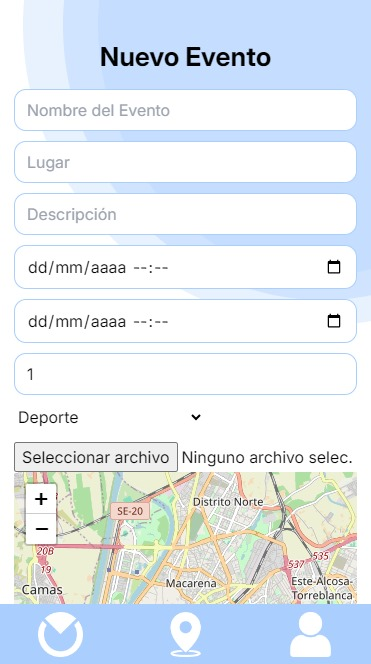
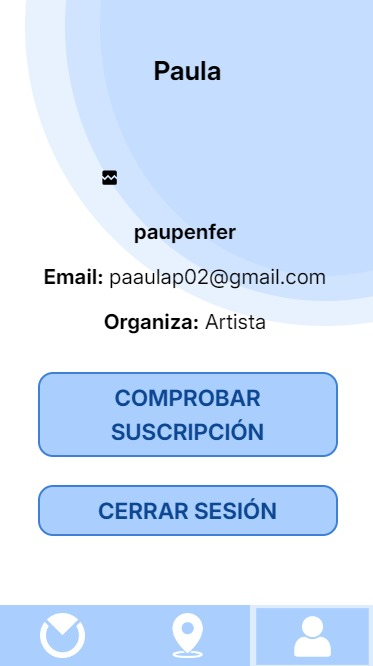
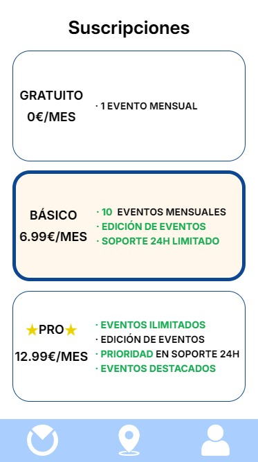

# Software Revision
---

<MDXLayout>
  
</MDXLayout>

---

# SPRINT 3

### GRUPO 2

### Miembros

- Aitor Rodríguez Dueñas: Writing S1
- Paula Peña Fernández: Writing S2
- Adrián Romero Flores: Writing S2

# **Historial de versiones**

|Fecha|Versión|Descripción |Entrega|
| :- | :- | :- | :- |
|04/03/2024|V1.0|Review S1|S1|
|01/04/2024|V2.0|Review S2|S2|
|||||
|||||

## INTRODUCCIÓN

Detalles a tener en cuenta para la revisión y prueba de la versión del Sprint 2 de la aplicación ‘Ocial’.

## ENLACES RELEVANTES

URL Landing Page: <https://ocial.es/> 

URL deployment platform: <https://app.ocial.es/> 

URL Github repository: <https://github.com/ispp-2324-ocial> 

URL Clockify: <https://app.clockify.me/shared/660ac19e1e41eb36ffd2ee0d> 

## CREDENCIALES

|TIPO DE PERFIL DE USUARIO|USUARIO|CONTRASEÑA|
| :- | :- | :- |
|CLIENTE 1|NereaRomero|p4$$word1|
|CLIENTE 2|AliciaPerezPortillo|p4$$word2|
|CLIENTE 3|DanielGB|p4$$word3|
|CLIENTE 4|cafeteriaetsii|ocialpass123|
|USUARIO 1|aitor|p4$$word|

Las cuentas de Cliente 1, 2 y 3 tiene datos introducidos (eventos creados).

La cuenta de Cliente 4 no tiene ningún dato para que se pruebe las funcionalidades.

## CASOS DE USO
Una vez que cliquemos en el URL aportado como plataforma desplegada, nos dirigirá directamente a esta pantalla

Al intentar pulsar en los 3 botones, le dirigirá directamente a registrarse/iniciar sesión.
### CASO 1
El usuario, como cliente o usuario, se registra en el sistema. 

El usuario verá esta pantalla y si no tiene ninguna cuenta ya registrada tendrá que crearse una. Pulsará la palabra ‘Regístrate’ o Acceder mediante una cuenta de google (esta en modo desarrollo y solo permite correos predefinidos si quiere probar esta funcionalidad escriba un correo a adrromflo@alum.us.es con un correo de gmail válido). Si es un perfil de usuario se registrará en ese formulario, pero si va a crear una cuenta de empresa, es decir, va a ser cliente de la aplicación, pulsará en el botón ‘Cuenta de Negocio’. Deberá de Aceptar los términos y condiciones antes de crear la cuenta.

Una vez registrado, deberá volver a clickar en el icono de usuario y el usuario ya podrá iniciar sesión y adentrarse en la aplicación.

### CASO 2

Usuario navega y explora el mapa.

Una vez que inicias sesión, te envía a la pantalla principal (botón central). Podrás dar permiso para que utilice tu ubicación y podrás navegar por tu zona para encontrar eventos creados.

Podemos buscar en el buscador alguna palabra para que filtre por eventos que contengan esa palabra.

Al pulsar sobre el logo del evento aparecerá una caja de información sobre el evento. Si pulsamos en ‘Ver detalles’ nos lleva hasta una pantalla donde aparece la información del evento de manera más detallada.

###
### CASO 3
El usuario puede ver su perfil y cerrar sesión

### CASO 4
Cliente puede ver y crear sus eventos

Si nos registramos como cliente, y le damos al boton de la izquierda podremos ver los eventos que has creado y un boton para crear un evento nuevo

### CASO 5
Cliente puede ver su perfil, subscripción y cerrar sesión

Si le damos al botón de la derecha podremos ver los detalles de nuestra cuenta como clientes de Ocial.

Si le damos al botón de comprobar subscripción nos enviara a una pantalla donde podremos ver nuestra suscripción activa y ver los detalles de las demas suscripción.

## REQUERIMIENTOS
- Conexión a Internet.
- Ubicación activada y dar permisos al navegador para rastrear la ubicación.

## DEMO

<MDXLayout>
  <embed src="/assets/files/OcialDemo2-65d7ec431b32e0d8eca14a0a41f360f7.mp4" type="video/mp4" width="100%" height="600px" />
</MDXLayout>

[ENLACE AL VIDEO](../../static/videos/OcialDemo2.mp4)