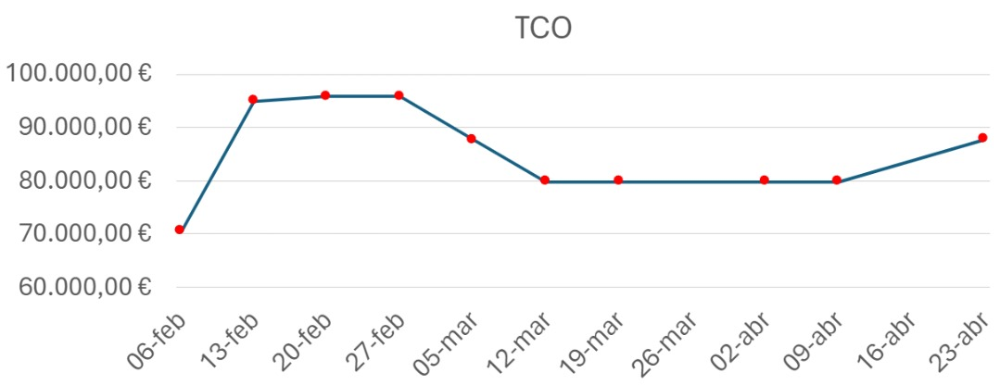
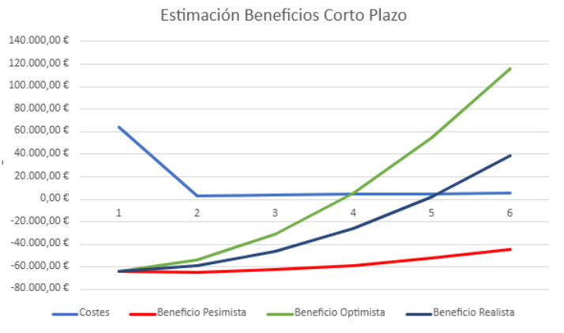
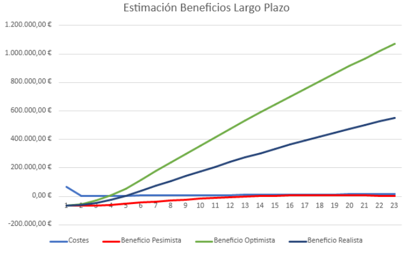

# TCO
---

<MDXLayout>
  
</MDXLayout>

---

# SPRINT 2

### GRUPO 2

### Miembros que han contribuido

- Carlos Varela Soult: Writing DP
- Raúl Montalbán Martín: Writing DP
- José Carlos Ortiz Gutiérrez: Writing S1
- Iñigo Ruiz Marchueta: Writing S1, S2 and Review
- Paula Peña Fernández: Writing S1, S2 and Review
- Adrián Romero Flores: Review

### Índice

- [TCO](#tco)
- [SPRINT 2](#sprint-2)
    - [GRUPO 2](#grupo-2)
    - [Miembros que han contribuido](#miembros-que-han-contribuido)
    - [Índice](#índice)
    - [Historial de versiones](#historial-de-versiones)
    - [Hora de servicio mínima](#hora-de-servicio-mínima)
    - [CAPEX](#capex)
      - [Desarrollo](#desarrollo)
      - [Infraestructuras y licencias](#infraestructuras-y-licencias)
    - [OPEX](#opex)
      - [Costes de Infraestructuras y Licencias](#costes-de-infraestructuras-y-licencias)
      - [Costes de operación mensual](#costes-de-operación-mensual)
      - [Costes de Recompensa Usuarios Pilotos](#costes-de-recompensa-usuarios-pilotos)
    - [Evolución del TCO](#evolución-del-tco)
    - [Estimación del TCO](#estimación-del-tco)
    - [Desarrollo TCO en 24 meses](#desarrollo-tco-en-24-meses)
- [Análisis de Escenarios](#análisis-de-escenarios)
  - [ESTIMACIÓN PESIMISTA 2%](#estimación-pesimista-2)
    - [Bares](#bares)
    - [Ocio Nocturno](#ocio-nocturno)
    - [Autónomo](#autónomo)
  - [ESTIMACIÓN OPTIMISTA 10%](#estimación-optimista-10)
    - [Bares](#bares-1)
    - [Ocio Nocturno](#ocio-nocturno-1)
    - [Autónomo](#autónomo-1)
  - [ESTIMACIÓN REALISTA 5%](#estimación-realista-5)
    - [Bares](#bares-2)
    - [Ocio Nocturno](#ocio-nocturno-2)
    - [Autónomo](#autónomo-2)
    - [Estimación a Corto Plazo](#estimación-a-corto-plazo)
    - [Estimación a Largo Plazo](#estimación-a-largo-plazo)
- [Bibliografía](#bibliografía)

### Historial de versiones
| Fecha      | Versión | Descripción                           | Entrega |
|------------|---------|---------------------------------------|---------|
| 20/02/2024 | V1.0    | Versión inicial de análisis de costes | DP      |
| 04/03/2024 | V2.0    | Actualización S1                      | S1      |
| 01/04/2024 | V3.0    | Actualización S2                      | S2      |

### Hora de servicio mínima 
|HSM | 20 € |
|--|-----|

### CAPEX

#### Desarrollo
| Coste | 52.800,00 € |
|--|-----|

| Rol | HSM | Cantidad |Meses| Sueldo mensual |
|---|---|---|---|---|
| Programador web | x1 | 10 | 4| 800€ |
| Analista programador web | x1.5 | 2 |4| 1.200 € |
| Jefe de proyecto | x2 | 1 |4| 1.600 € |
| Diseñador gráfico | x1.5 | 1 | 4| 1.200 € |

#### Infraestructuras y licencias
| Coste | 2.442,00 € |
|--|-----|

|Paquete|Meses|Precio|Cantidad|
|---|---|---|---|
|Oficina |4|360 €/mes|1|
|Portatiles|---|1.000 €|14|
|Dominio|---|2 €|1|

### OPEX

#### Costes de Infraestructuras y Licencias
| Coste | 2.877,28 € |
|--|-----|

| Paquete | Precio/mes | Cantidad | Meses | Total |
|---|---|---|---|---|
| Google Cloud | 302,92 € | 1 | 4 | 1.211,68 € |
| GitHub Enterprise | 19,51 € | 14 | 4 | 1.092,56 € |
| GitHub Copilot | 9,28 € | 14 | 4 | 519,68 € |
| SonarCloud | 11,00 € | 1 | 4 | 44,00 € |
| Github Actions | 2,34 € | 1 | 4 | 9,36 € |
| Email Check | 0,00 € | 1 | 2 | 0 € |

#### Costes de operación mensual 
| Coste | 2.005,24 € |
|--|-----|

| Paquete | Precio/mes | Cantidad | Meses | Total |
|---|---|---|---|---|
| Técnico de soporte nivel 1 | 800,00 € | 2 | 1 | 1.600,00 € |
| Google Cloud | 302,92 € | 1 | 1 | 302,92 € |
| GitHub Enterprise | 19,51 € | 2 | 1 | 39,02 € |
| SonarCloud | 11,00 € | 1 | 1 | 11,00 € |
| GitHub Actions | 2,30 € | 1 | 1 | 2,30 € |
| Email Check | 50,00 € | 1 | 1 | 50,00 € |

#### Costes de Recompensa Usuarios Pilotos
| Coste |  1.402,92 € |
|--|-----|

| Rol | Precio/mes | Cantidad | Meses | Total |
|---|---|---|---|---|
| Usuarios Pilotos Cliente | 12,99 € | 9 | 12 | 1.402,92 € |

### Evolución del TCO 

### Estimación del TCO
Contingencia del 10% 
__TCO Mensual = 6.690 €__ 
Estimación con 1000 usuarios concurrentes

### Desarrollo TCO en 24 meses

# Análisis de Escenarios

## ESTIMACIÓN PESIMISTA 2%

### Bares

|  SUSCRIPCIÓN | PRECIO/MES | CANTIDAD | MESES | TOTAL |
|---|---|---|---|---|
| BÁSICO | 6,99 | 1100 | 10 | 76.890,00 € |
| PRO | 12,99 | 100 | 10 | 12.990,00 € |

### Ocio Nocturno

| SUSCRIPCIÓN | PRECIO/MES | CANTIDAD | MESES | TOTAL |
|---|---|---|---|---|
| BÁSICO | 6,99 | 135 | 12 | 11.323,80 € |
| PRO | 12,99 | 15 | 12 | 2.338,20 € |

### Autónomo 

| SUSCRIPCIÓN | PRECIO/MES | CANTIDAD | MESES | TOTAL |
|---|---|---|---|---|
| BÁSICO | 6,99 | 450 | 12 | 37.746,00 € |
| PRO | 12,99 | 50 | 12 | 7.794,00 € |

|**Total** | **149.082,00 €** |
|---|---|

## ESTIMACIÓN OPTIMISTA 10%

### Bares

|  SUSCRIPCIÓN | PRECIO/MES | CANTIDAD | MESES | TOTAL |
|---|---|---|---|---|
| BÁSICO | 6,99 | 5750 | 12 | 482.310,00 € |
| PRO | 12,99 | 250 | 12 | 38.970,00 € |

### Ocio Nocturno

| SUSCRIPCIÓN | PRECIO/MES | CANTIDAD | MESES | TOTAL |
|---|---|---|---|---|
| BÁSICO | 6,99 | 700 | 12 | 58.716,00 € |
| PRO | 12,99 | 50 | 12 | 7.794,00 € |

### Autónomo 

| SUSCRIPCIÓN | PRECIO/MES | CANTIDAD | MESES | TOTAL |
|---|---|---|---|---|
| BÁSICO | 6,99 | 2350 | 12 | 197.118,00 € |
| PRO | 12,99 | 150 | 12 | 23.382,00 € |

|**Total** | **808.290,00 €** |
|---|---|

## ESTIMACIÓN REALISTA 5%

### Bares

|  SUSCRIPCIÓN | PRECIO/MES | CANTIDAD | MESES | TOTAL |
|---|---|---|---|---|
| BÁSICO | 6,99 | 3800 | 10 | 265.620,00 € |
| PRO | 12,99 | 200 | 10 | 25.980,00 € |

### Ocio Nocturno

| SUSCRIPCIÓN | PRECIO/MES | CANTIDAD | MESES | TOTAL |
|---|---|---|---|---|
| BÁSICO | 6,99 | 325 | 12 | 27.261,00 € |
| PRO | 12,99 | 50 | 12 | 7.794,00 € |

### Autónomo 

| SUSCRIPCIÓN | PRECIO/MES | CANTIDAD | MESES | TOTAL |
|---|---|---|---|---|
| BÁSICO | 6,99 | 1150 | 12 | 96.462,00 € |
| PRO | 12,99 | 100 | 12 | 15.588,00 € |

|**Total** | **438.705,00 €** |
|---|---|

### Estimación a Corto Plazo

### Estimación a Largo Plazo

# Bibliografía
Intencionadamente en blanco

