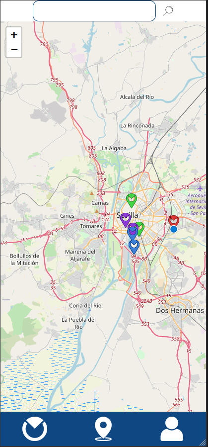
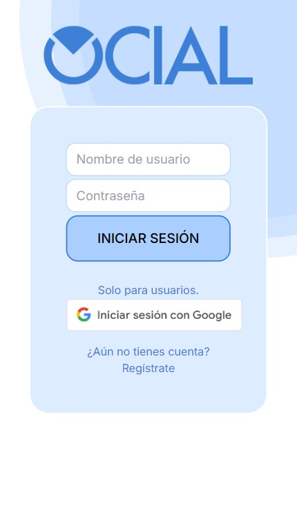
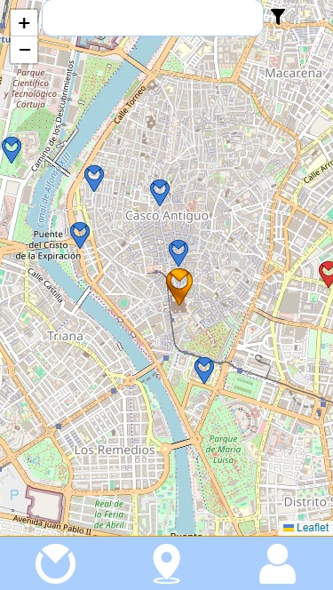
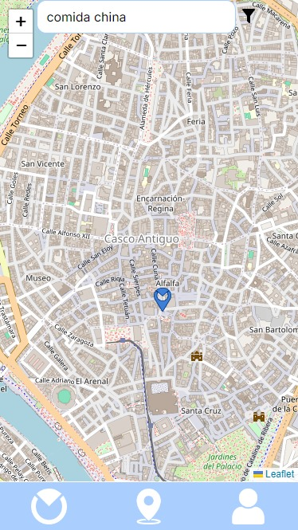
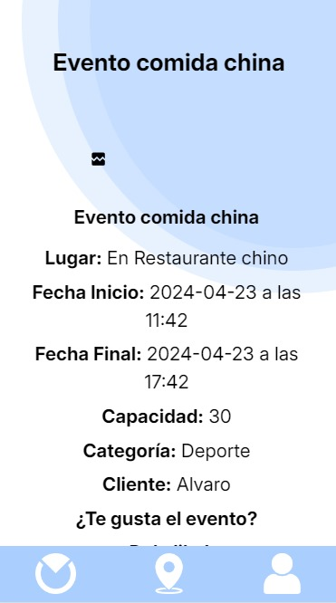
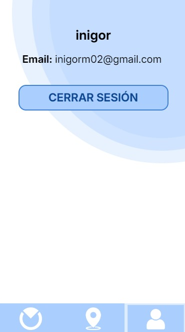
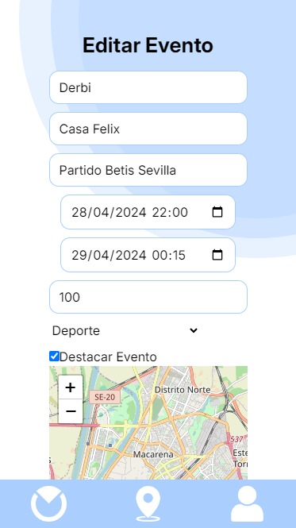
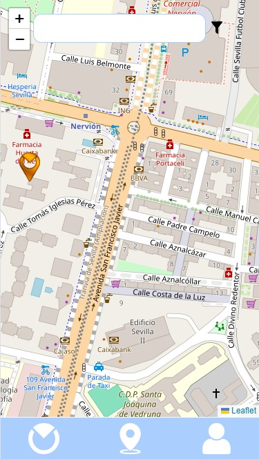

# Revision
---

<MDXLayout>
  
</MDXLayout>

---

# GRUPO 2

### SPRINT 3

|Fecha|Versión|Autores|Descripción |Entrega|
| :- | :- |:-| :- | :- |
|04/03/2024|V1.0|Aitor Rodríguez Dueñas |Review S1|S1|
|01/04/2024|V2.0|Paula Peña Fernández, Adrián Romero Flores | Review S2|S2|
|21/04/2024|V3.0|Paula Peña Fernández| Review S3|S3|

## INTRODUCCIÓN

Detalles a tener en cuenta para la revisión y prueba de la versión del Sprint 2 de la aplicación ‘Ocial’.

## ENLACES RELEVANTES

URL Landing Page: <https://ocial.es/> 

URL deployment platform: <https://app.ocial.es/> 

URL Github repository: <https://github.com/ispp-2324-ocial> 

URL Clockify: <https://app.clockify.me/shared/6626aabb0730fe5f66bff641> 

## CREDENCIALES

|TIPO DE PERFIL DE USUARIO|USUARIO|CONTRASEÑA|
| :- | :- | :- |
|CLIENTE 1|*|*|
|CLIENTE 2|*|*|
|USUARIO 1|*|*|
|USUARIO 2|*|*|
|ADMIN|*|*|

*Las credenciales se enviarán por mensaje de curso

## CASOS DE USO
Una vez que cliquemos en el URL aportado como plataforma desplegada, nos dirigirá directamente a esta pantalla

Al intentar pulsar en los 3 botones, le dirigirá directamente a registrarse/iniciar sesión.

**Caso de uso 1**:Cliente/usuario se registra e inicia sesión en la aplicación como negocio/usuario(Caso de uso implementado en #S1)

El usuario verá esta pantalla y si no tiene ninguna cuenta ya registrada tendrá que crearse una. Pulsará la palabra ‘Regístrate’ o Acceder mediante una cuenta de google (esta en modo desarrollo y solo permite correos predefinidos si quiere probar esta funcionalidad escriba un correo a adrromflo@alum.us.es con un correo de gmail válido). Si es un perfil de usuario se registrará en ese formulario, pero si va a crear una cuenta de empresa, es decir, va a ser cliente de la aplicación, pulsará en el botón ‘Cuenta de Negocio’. Deberá de Aceptar los términos y condiciones antes de crear la cuenta.

Una vez registrado, deberá volver a clickar en el icono de usuario y el usuario ya podrá iniciar sesión y adentrarse en la aplicación.

**Caso de uso 2**:Usuario navega por el mapa(Caso de uso implementado en #S1)

Una vez que inicias sesión, te envía a la pantalla principal (botón central). Podrás dar permiso para que utilice tu ubicación y podrás navegar por tu zona para encontrar eventos creados.

**Caso de uso 3**:Usuario busca un evento que contenga una/s palabra/s concreta/s(Caso de uso implementado en #S2)

Al pulsar sobre el logo del evento aparecerá una caja de información sobre el evento. Si pulsamos en ‘Ver detalles’ nos lleva hasta una pantalla donde aparece la información del evento de manera más detallada.

**Caso de uso 4**:El Usuario valora el evento dando like(Caso de uso implementado en #S3)

**Caso de uso 5**:Usuario comparte un evento(Caso de uso implementado en #S3)

**Caso de uso 6**:El usuario puede ver su perfil y cerrar sesión

**Caso de uso 7**:Un Cliente crea un evento(Caso de uso implementado en #S2)

**Caso de uso 8**:Un Cliente edita un evento (Caso de uso implementado en #S3)(Suscripción BASIC y PRO)

**Caso de uso 9**:Un Cliente destaca un evento(Caso de uso implementado en #S3)(Suscripción PRO)

**Caso de uso 10**:El cliente observa su lista de eventos creados(Caso de uso implementado en #S2)

**Caso de uso 11**:El cliente selecciona el tipo de suscripción que se ajusta a sus necesidades(Caso de uso implementado en #S3)

**Caso de uso 12**:El Cliente paga por el sevicio de una suscripción(Caso de uso implementado en #S3)

Si le damos al botón de la derecha podremos ver los detalles de nuestra cuenta como clientes de Ocial.

## REQUERIMIENTOS
- Conexión a Internet.
- Ubicación activada y dar permisos al navegador para rastrear la ubicación.
- Preferiblemente no usar firefox como navegador.

## DEMO

<MDXLayout>
  <embed src="/assets/files/DemoOcialS3-2d6f58995c728ff3dd33f6f628107ce3.mp4" type="video/mp4" width="100%" height="600px" />
</MDXLayout>

[ENLACE AL VIDEO](../../../static/videos/DemoOcialS3.mp4)